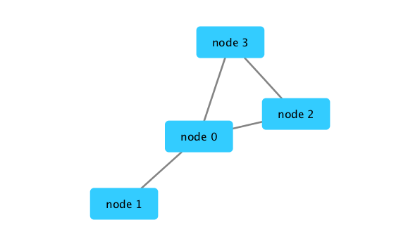
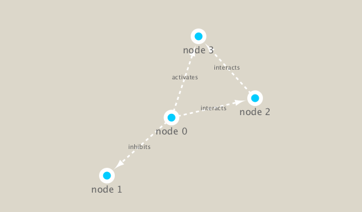

```{r setup, include=FALSE}
knitr::opts_chunk$set(echo = TRUE)
```

```{r}
library(RCy3)
library(igraph)
library(RColorBrewer)
```

Test the connection of R to Cytoscape
```{r}
cytoscapePing()
```

Check the version
```{r}
cytoscapeVersionInfo()
```

We can test things further by making a small network (here in igraph format as used by the R igraph package) and sending it to Cytoscape
```{r}
g <- makeSimpleIgraph()
createNetworkFromIgraph(g,"myGraph")
```

Include the Cytoscape output in our report using the folowing pieces of code:
```{r}
fig <- exportImage(filename="demo", type="png", height=350)

```

You can change the style.
```{r}
setVisualStyle("Marquee")
```

```{r}
fig <- exportImage(filename="demo_marquee", type="png", height=350)

```

What oher styles are available?
```{r}
styles <- getVisualStyleNames()
styles
```


Side-note: You can of course just plot your igraph objects in R itself:
```{r}
plot(g)
```


# Readout metagenomics data

Scripts for processing located in "inst/data-raw/"
```{r}
prok_vir_cor <- read.delim("virus_prok_cor_abundant.tsv", stringsAsFactors = FALSE)
head(prok_vir_cor)
```

Use the igraph package to convert the dataframe into a network we can send to Cytoscape.
```{r}
g <- graph.data.frame(prok_vir_cor, directed = FALSE) #graph will be undirected
class(g)
```

```{r}
g
```
UNW = undirected, named, and weighted

This dataset is too large, but plot it anyway
```{r}
plot(g)
```
 
 Turn off the text labels
```{r}
plot(g, vertex.label=NA)
```
 
Make nodes/vertex smaller
```{r}
plot(g, vertex.size=3, vertex.label=NA)
```

You can also use the ggplot extension package ggraph to graph these networks.
```{r}
library(ggraph)
```

```{r}
ggraph(g, layout = 'auto') +
  geom_edge_link(alpha = 0.25) +
  geom_node_point(color="steelblue") +
  theme_graph()
```

Send this network to Cytoscape
```{r}
createNetworkFromIgraph(g,"myIgraph")
```
Note that we can query (and set) vertex and edge attributes with the V() and E() functions respectively:
```{r}
V(g)
```
```{r}
E(g)
```

Community detection algorithms
```{r}
cb <- cluster_edge_betweenness(g)
```
```{r}
cb
```
Then plot
```{r}
plot(cb, y=g, vertex.label=NA,  vertex.size=3)
```

You can extract a cluster/community membership vector for further inspection with the membership() function:
```{r}
head( membership(cb) )
```

The degree of a node or vertex is its most basic structural property, the number of its adjacent edges. Here we calculate and plot the node degree distribution.
```{r}
d <- degree(g)
hist(d, breaks=30, col="lightblue", main ="Node Degree Distribution")
```
For the degree_distribution() function a numeric vector of the same length as the maximum degree plus one is returned. The first element is the relative frequency zero degree vertices, the second vertices with degree one, etc.
```{r}
plot( degree_distribution(g), type="h" )
```

Centrality gives an estimation on how important a node or edge is for the connectivity (or the information flow) of a network. It is a particularly useful parameter in signaling networks and it is often used when trying to find drug targets for example.

One centrality method that you can often find in publications is the Google PageRank score. For the explanation of the PageRank algorithm, see the following webpage: http://infolab.stanford.edu/~backrub/google.html

```{r}
pr <- page_rank(g)
head(pr$vector)
```

Make a size vector btwn 2 and 20 for node plotting size
```{r}
library(BBmisc)
v.size <- BBmisc::normalize(pr$vector, range=c(2,20), method="range")
plot(g, vertex.size=v.size, vertex.label=NA)
```
One of the simplest centrality scores is of course degree that we calculated previously and stored as the object d.
```{r}
v.size <- BBmisc::normalize(d, range=c(2,20), method="range")
plot(g, vertex.size=v.size, vertex.label=NA)
```
Another very common centrality score is betweenness. The vertex and edge betweenness are (roughly) defined by the number of geodesics (shortest paths) going through a vertex or an edge.
```{r}
b <- betweenness(g)
v.size <- BBmisc::normalize(b, range=c(2,20), method="range")
plot(g, vertex.size=v.size, vertex.label=NA)
```

